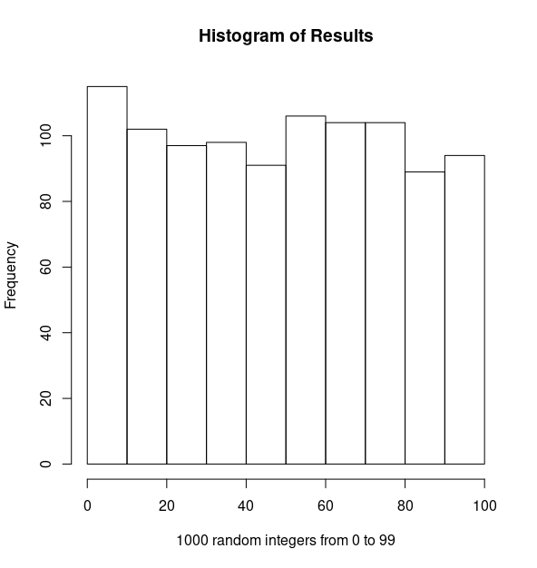

# replaceR
Drop-in replacement for the standalone R math library if all you need is `runif()`.

This allows you to use `set_seed()` and `runif(a, b)` in `C` just as if you were using the `Rmath.h` standalone library.
<<<<<<< HEAD
While it uses the same random number generator, I cannot guarantee that the seeds will produce the same results as base `R`.
=======
While it uses the same random number generator as base `R`, I cannot guarantee that the seeds will produce the same results as `R`.
>>>>>>> 752148561ebbc3f898fc9020702620d48a7f3326
However, results are reproducible. There are further functions available in the Mersenne Twister code if you want.
Read their code or their `readme-mt.txt` for more details. Or check out their
[web-page](http://www.math.sci.hiroshima-u.ac.jp/~m-mat/MT/emt.html). I have, essentially, only provided
a small wrapper around their code to make it mimic the behavior of the `R` library for those two functions.
If you want something more than that, don't use this! Either roll your own or, better, use the `R` standalone math
library.
I have also included a `randint(bound)` function which produces fast, unbiased uniform random integer
generation in the range `[0, bound)`. This is better than doing something like `n * runif(0,1)`.

I have included a couple other initialization functions as examples - one that uses a simple hash of the arguments
to the function and one that uses that plus the provided seed as well. Note the hash is a very simple one,
but this does give a way to quickly get reproducible results for testing without having to worry about explicitly
setting and storing a seed while also getting different results for different inputs. 


The `mt19937ar.*` files are copyright their original owners subject to their
terms. See those files for details.

To compile and run an example, try:

    gcc mt19937ar.c replaceR.c testreplaceR.c -o testreplaceR
    ./testreplaceR

The results here should agree with the results in `ReplaceResults.txt`.

Here is a histogram of 1000 random integers generated from the interval [0,100):



And results of a Kolmogorov-Smirnov test of the data in `R`:

```
	Two-sample Kolmogorov-Smirnov test

data:  res and rep(0:99, 10)
D = 0.011, p-value = 1
alternative hypothesis: two-sided
```

Your results should agree.
